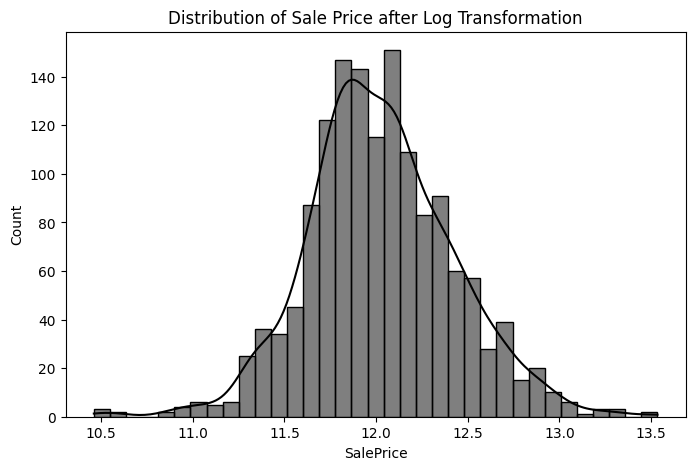
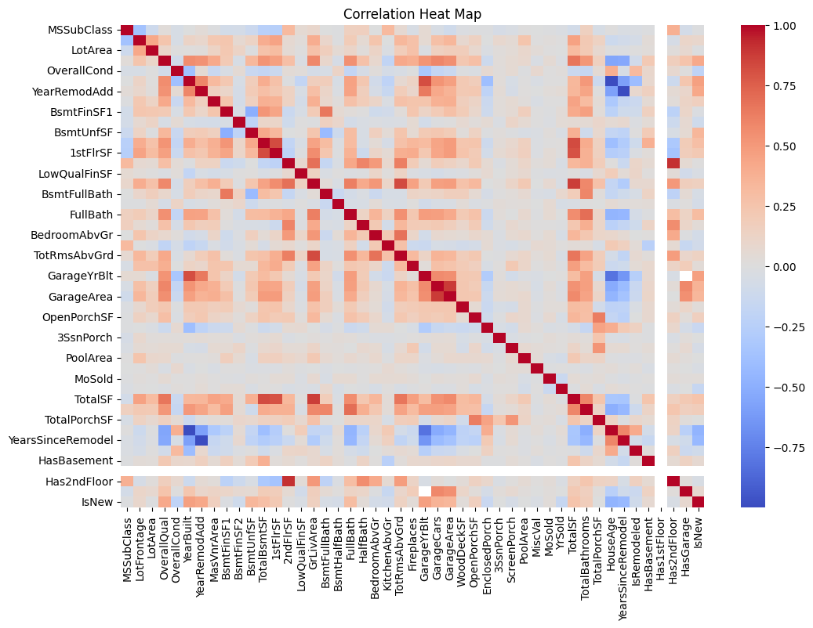
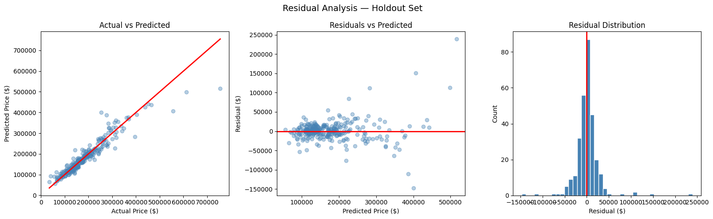
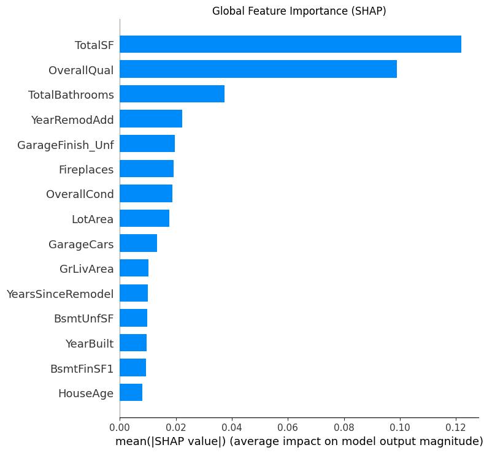
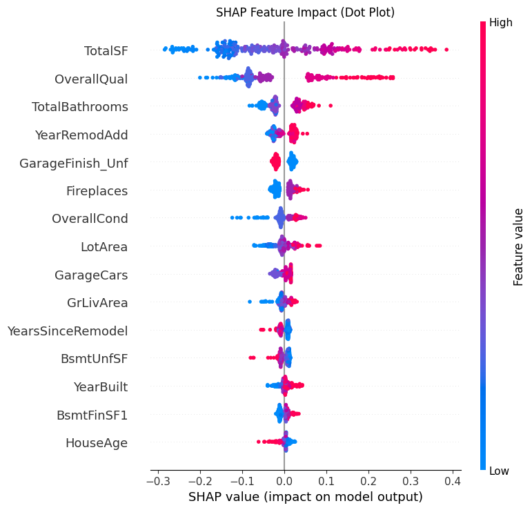
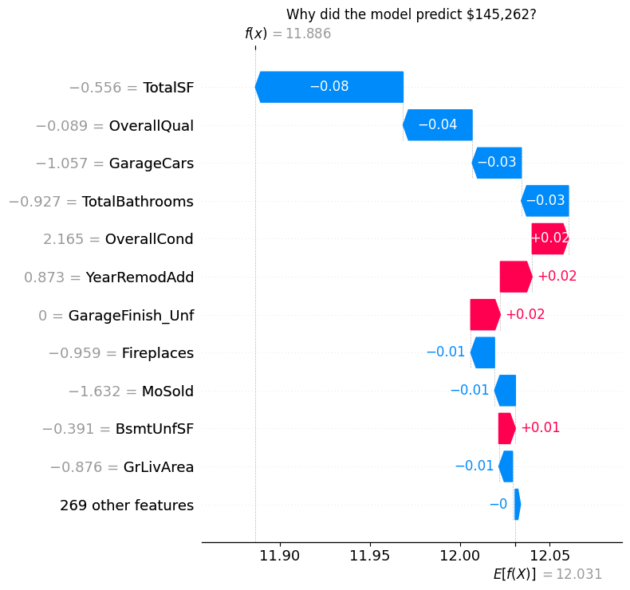

# 🏠 House Price Prediction — Advanced Machine Learning Project


A complete end-to-end machine learning pipeline to predict house prices using advanced regression models, with strong emphasis on **data preprocessing, feature engineering, model validation, and explainability**.

---

## 🔥 Highlights

- 📈 Improved Kaggle score from **0.155 → 0.134**
- 🎯 Achieved **$15,901 MAE** using XGBoost
- 🔍 Used **5-fold cross-validation** for reliable evaluation
- ⚙️ Optimized hyperparameters using **GridSearchCV**
- 🧠 Integrated **SHAP** for model explainability
- 📊 Built a full **production-style sklearn Pipeline**

---

# 📂 Project Structure

```text
house-price-prediction/
│
├── app.py                        # Streamlit web application
├── train.py                      # Model training pipeline
├── requirements.txt              # Project dependencies
├── README.md                     # Project documentation
├── submission.csv                # Kaggle submission file
│
├── models/                       # Saved trained models & metadata
│   ├── house_price_pipeline.pkl
│   ├── feature_columns.pkl
│   ├── numerical_cols.pkl
│   └── categorical_cols.pkl
│
├── plots/                        # Visualizations & diagnostics
│   ├── Distribution_of_SalePrice_after_Log_Transformation.png
│   ├── Correlation_Heat_Map.png
│   ├── relationship_of_top_6_features_with_SalePrice.png
│   ├── Actual_vs_Predicted_Prices(XGBoost).png
│   ├── residual_analysis.png
│   ├── shap_global.png
│   ├── shap_dot.png
│   ├── shap_individual.png
│   └── app_ui.png
│
├── data/                         # Dataset files (optional / gitignored)
│   ├── train.csv
│   └── test.csv
│
└── .gitignore
```

## ⚙️ Workflow

### 🔹 1. Data Preprocessing
- Applied `log1p` transformation to `SalePrice` to reduce skewness
- Dropped columns with more than 50% missing values
- Filled numerical nulls with **median**, categorical nulls with **mode** (inside sklearn Pipeline)

### 🔹 2. Feature Engineering
Created domain-informed features:

| Feature | Description |
|---|---|
| `TotalSF` | Basement + 1st floor + 2nd floor area |
| `TotalBathrooms` | Full + half baths (weighted) |
| `TotalPorchSF` | Sum of all porch areas |
| `HouseAge` | Year sold minus year built |
| `YearsSinceRemodel` | Year sold minus remodel year |
| `IsRemodeled` | Binary flag — was the house remodeled? |
| `HasBasement` | Binary flag |
| `HasGarage` | Binary flag |
| `Has2ndFloor` | Binary flag |
| `IsNew` | Binary flag — built within last 2 years |

### 🔹 3. Modeling Pipeline
Each model was wrapped in a reusable sklearn `Pipeline` with:
- `SimpleImputer` + `StandardScaler` for numerical features
- `SimpleImputer` + `OneHotEncoder` for categorical features

| Model | Role |
|---|---|
| Linear Regression | Baseline |
| Random Forest | Ensemble comparison |
| XGBoost | Final model |

### 🔹 4. Evaluation
- **R² Score** — overall model fit
- **MAE** — average prediction error in dollars
- **RMSE** — penalizes large individual errors
- Used **5-fold CV** on training set + final evaluation on a held-out test set (80/20 split)

---

## 📊 Results

| Model | MAE ($) | RMSE ($) | R² Score |
|---|---|---|---|
| Linear Regression | 17,061 | 63,440 | 0.84 |
| Random Forest | 17,601 | 30,434 | 0.87 |
| **XGBoost** | **15,901** | **27,868** | **0.90** |

🏆 **Best Model: XGBoost**

### Kaggle Submission Score

| Stage | Score |
|---|---|
| Initial Model | 0.155 |
| Final Model | 0.134 |

---

## 📈 Visualizations

### Distribution of SalePrice (After Log Transformation)


### Correlation Heatmap


### Actual vs Predicted Prices (XGBoost)
.png)

### Residual Analysis


### SHAP — Global Feature Importance


### SHAP — Feature Impact (Dot Plot)


### SHAP — Individual Prediction Explanation


---

## 🧠 Model Explainability (SHAP)

SHAP (SHapley Additive exPlanations) was used to explain model predictions at both global and individual levels:

- **Global bar chart** — which features influence price the most on average
- **Dot plot** — direction and magnitude of each feature's impact per house
- **Waterfall plot** — why the model predicted a specific price for a single house

Top contributing features:
- Overall Quality
- Total Square Footage
- Garage Capacity
- House Age

---

## ⚠️ Challenges & Solutions

| Challenge | Solution |
|---|---|
| Data leakage | Used sklearn Pipeline + proper train/holdout split |
| Skewed target variable | Applied `log1p` transformation |
| Inconsistent preprocessing across train/test | Fit preprocessor only on training data via Pipeline |
| Overfitting | Cross-validation throughout; CV score ≈ holdout score |

---

## 🛠️ Tech Stack

- Python 3.10
- pandas, NumPy
- scikit-learn
- XGBoost
- SHAP
- Matplotlib, Seaborn
- Joblib

---

## ⚙️ Installation

```bash
pip install -r requirements.txt
```

# ▶️ Run Locally

## 1️⃣ Clone Repository

```bash
git clone https://github.com/hisham2-art/house-price-prediction.git
cd house-price-prediction
```

---

## 2️⃣ Install Dependencies

```bash
pip install -r requirements.txt
```

---

## 3️⃣ Run Streamlit App

```bash
streamlit run app.py
```

The app will open in your browser at:

```text
http://localhost:8501
```

---

## 4️⃣ (Optional) Retrain Model

```bash
python house_price.py
```

---

## 🎯 Future Improvements

- Target encoding for high-cardinality categorical features
- Additional feature engineering (price per sq ft, neighbourhood age)
- Model ensembling (stacking XGBoost + Random Forest)
- Streamlit web app for interactive predictions

---

## 🙌 Acknowledgements

- [Kaggle — House Prices: Advanced Regression Techniques](https://www.kaggle.com/competitions/house-prices-advanced-regression-techniques)
- scikit-learn, XGBoost, and SHAP open-source libraries
