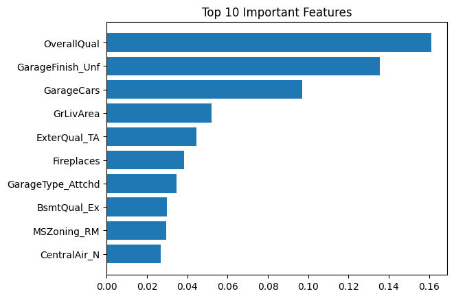

# 🏠 House Price Prediction — Advanced Machine Learning Project


🚀 A complete end-to-end machine learning pipeline to predict house prices using advanced regression models with strong emphasis on **data preprocessing, validation, and real-world performance**.

---

## 🔥 Highlights

* 📈 Improved Kaggle score from **0.155 → 0.134**
* 🎯 Achieved **$15,901 MAE** using XGBoost
* 🔍 Used **cross-validation** for reliable evaluation
* ⚙️ Optimized models using **GridSearchCV**
* 📊 Built a full **production-style ML pipeline**

---

## 📊 Data Understanding

### Distribution After Log Transformation


✔️ Log transformation reduces skewness and makes the data closer to a normal distribution, improving model learning.

---

## 🔗 Feature Relationships

### Correlation Heatmap


✔️ Shows relationships between features
✔️ Helps identify important variables

---

## 📊 Feature Analysis

### Key Feature Relationships


✔️ Strong relationships observed:

* Overall Quality vs Price
* Living Area vs Price
* Garage Capacity vs Price

---

## 🤖 Model Performance

### Actual vs Predicted (XGBoost)


✔️ Predictions closely follow actual values
✔️ Indicates strong generalization

---

## 📈 Feature Importance



Top contributing features:

* Overall Quality
* Garage Finish
* Garage Capacity
* Living Area

---

## ⚙️ Workflow

### 🔹 Data Preprocessing

* Removed columns with >50% missing values
* Filled missing values:

  * Numerical → Median
  * Categorical → Mode
* Ensured consistent preprocessing

---

### 🔹 Feature Engineering

* One-hot encoding
* Feature alignment using `reindex()`

---

### 🔹 Modeling

| Model             | Purpose     |
| ----------------- | ----------- |
| Linear Regression | Baseline    |
| Random Forest     | Ensemble    |
| XGBoost           | Final model |

---

### 🔹 Evaluation Metrics

* **R² Score** → Model fit
* **MAE** → Average error
* **RMSE** → Penalizes large errors

📌 Used **cross-validation** to avoid overfitting

---

## 📊 Results

| Model             | MAE ($) | RMSE ($) | R² Score |
| ----------------- | ------- | -------- | -------- |
| Linear Regression | 17,061  | 63,440   | 0.84     |
| Random Forest     | 17,601  | 30,434   | 0.87     |
| XGBoost           | 15,901  | 27,868   | 0.90     |

🏆 **Best Model: XGBoost**

---

## 📈 Performance Improvement

| Stage         | Score |
| ------------- | ----- |
| Initial Model | 0.155 |
| Final Model   | 0.134 |

---

## ⚠️ Challenges & Fixes

* Fixed **data leakage** using cross-validation
* Ensured consistent preprocessing between datasets
* Applied log transformation for skewed data
* Avoided training-data evaluation bias

---

## 🧠 Concepts Demonstrated

* Cross-validation vs overfitting
* Feature importance interpretation
* Model comparison
* Data preprocessing pipeline
* Real-world ML evaluation

---

## 📂 Project Structure

```
house-price-prediction/
│
├── data/
├── plots/
│   ├── distribution.png
│   ├── correlation.png
│   ├── scatter.png
│   ├── prediction.png
│   └── top_features.png
│
├── house_price.py
├── submission.csv
├── requirements.txt
└── README.md
```

---

## ⚙️ Installation

```bash
pip install -r requirements.txt
```

---

## ▶️ Run

```bash
python house_price.py
```

---

## 🛠️ Tech Stack

* Python
* pandas
* NumPy
* scikit-learn
* XGBoost
* Matplotlib

---

## 🎯 Future Improvements

* Feature engineering (total area, house age)
* Target encoding
* Model ensembling
* Streamlit deployment

---

## 💼 Why This Project Matters

✔️ Demonstrates real-world ML workflow
✔️ Shows understanding of model evaluation
✔️ Highlights problem-solving and debugging skills

---

## 🙌 Acknowledgements

* Kaggle dataset
* Scikit-learn & XGBoost

---
