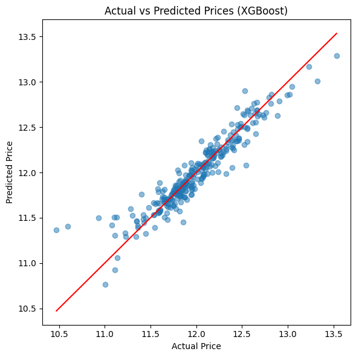
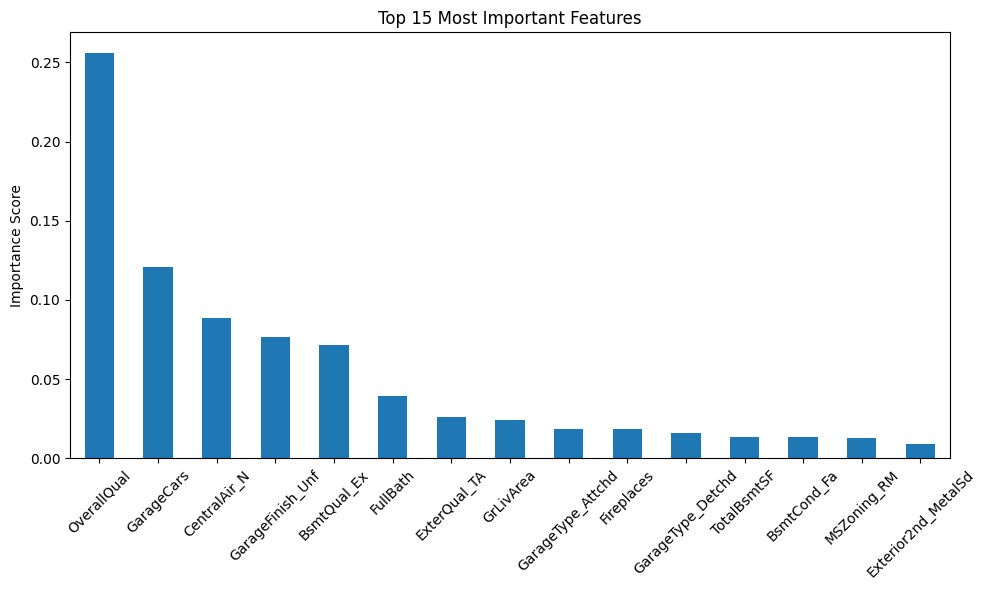

# 🏠 House Price Prediction

A machine learning project that predicts house prices using the Kaggle House Prices dataset.
Built using Python with Linear Regression, Random Forest, and XGBoost models.

---

## 📊 Dataset
- Source: [Kaggle - House Prices: Advanced Regression Techniques](https://www.kaggle.com/competitions/house-prices-advanced-regression-techniques)
- 1460 houses with 81 features each
- Target variable: SalePrice

---

## 🔍 Project Workflow

### 1. Exploratory Data Analysis (EDA)
- Checked dataset shape, dtypes and missing values
- Discovered SalePrice was right skewed → fixed with log transformation
- Found top correlated features using correlation heatmap
- Visualized relationships using scatter plots

### 2. Data Cleaning
- Dropped columns with more than 50% missing values
- Filled numerical missing values with median
- Filled categorical missing values with mode

### 3. Encoding
- Applied One Hot Encoding using pd.get_dummies()
- Expanded dataset from 76 to 273 columns

### 4. Modeling
Trained and compared three models:

| Model | MAE | RMSE | R2 Score |
|---|---|---|---|
| Linear Regression | $15,060 | $22,972 | **0.9312** 🏆 |
| Random Forest | $17,518 | $28,770 | 0.8921 |
| XGBoost | $17,018 | $27,050 | 0.9046 |

**Linear Regression performed best** after log transforming SalePrice!

---

## 📈 Results

### Actual vs Predicted Prices

### Top 15 Most Important Features

---

## 🛠️ Libraries Used
- pandas
- numpy
- matplotlib
- scikit-learn
- xgboost

---

## 🚀 How to Run
1. Clone the repo
2. Install dependencies: pip install pandas numpy matplotlib scikit-learn xgboost
3. Add `train.csv` to the `data/` folder
4. Run `house_price.py`

---

## 💡 Key Learnings
- Log transforming skewed target variables significantly improves Linear Regression
- A simple model with well prepared data can outperform complex models
- OverallQual (overall house quality) is the strongest predictor of house price